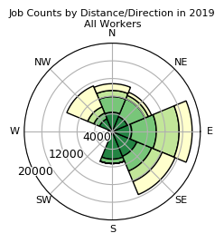
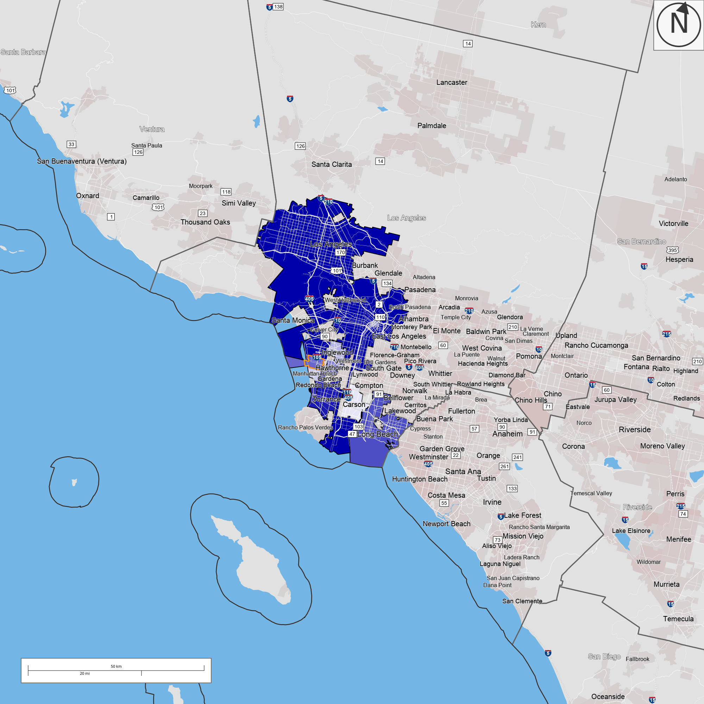
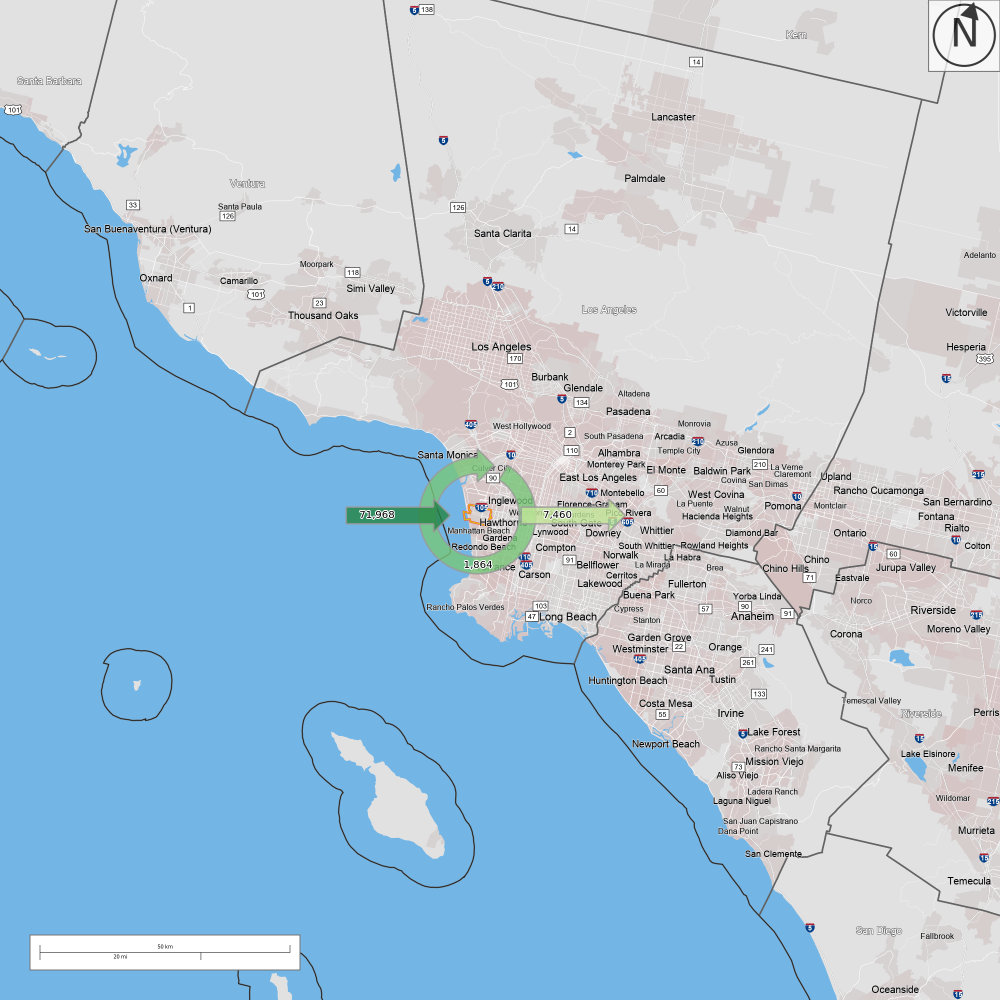
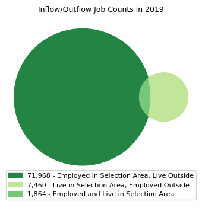

# Introduction

This analysis utilizes the Census Bureau's On The Map tool to identify trends and patterns in Los Angeles County's labor market pertaining to private sector employment change, manufacturing and poverty. Multiple tools are utilized including the area profile, distance/direction, destination analysis, and inflow/outflow analysis. 

```{r eval=TRUE, echo=TRUE, warning=FALSE, message=FALSE}
knitr::opts_chunk$set(echo = TRUE)

library(tidycensus)
library(sf)
library(tidyverse)
library(sf)
library(lubridate)
library(tigris)
library(gganimate)
library(riem)
library(gridExtra)
library(knitr)
library(kableExtra)
library(mapview)
library(tidycensus)
library(ggcorrplot)
library(RColorBrewer)
library(stargazer)
library(ggplot2)
library("scales")


#green <- c("#007e5d")
slay <- c("#95b8d1", "#b8e0d2")
#palette2 <- c("#f8c828","#007e5d")
#palette3 <- c("#f8c828","#007e5d","#a3b18a")
#palette5 <- c("#153b2c","#1c5c42","#97a397","#d4d7c4", "#e3bd6a")


```

# Private Sector Employment

The first section of this lab looks at private sector employment between Los Angeles County and the urban core, which for this analysis will be referring to the city of Los Angeles proper. The data first looks at industry data, then wage data both from 2014 to 2019.

## Industry Data

First looking at industry data provides a basis of the status of private sector employment at both a regional and local scope.

```{r eval=TRUE, echo=TRUE, warning=FALSE, message=FALSE}
county_industry <- read_csv("county_industry_data.csv") 
county_industry <- county_industry %>% dplyr::select(industry, count, Year)

county_wage <- read_csv("county_wage_data.csv")
county_wage <- county_wage %>% dplyr::select(wage, count, year)

uc_industry <- read_csv("urbancore_industry_data.csv")
uc_industry <- uc_industry %>% dplyr::select(industry, count, Year)

uc_wage <- read_csv("urbancore_wage_data.csv")
uc_wage <- uc_wage %>% dplyr::select(wage, count, year)

```

### Los Angeles County

The five industries that grew the fastest in Los Angeles County includes Health Care and Social Assistance, Information, Accommodation and Food Services, Transportation and Warehousing and Construction. These results are expected, especially for health care and social assistance as this has been the prevalent industry in prior industry analyses on the region. 	

```{r eval=TRUE, echo=TRUE, warning=FALSE, message=FALSE}
county_industry_wide <- county_industry %>%
  pivot_wider( names_from = Year,
  values_from = c("count"),
  values_fill = 0)

county_industry_wide <- county_industry_wide %>%
  rename(count_2019 = "2019",
         count_2014 = "2014")

county_industry_wide <- county_industry_wide %>%
  mutate(change = count_2019 - count_2014)

county_top5 <- county_industry_wide[order(county_industry_wide$change,decreasing=T)[1:5],]
county_btm5 <- county_industry_wide[order(county_industry_wide$change,decreasing=F)[1:5],]

county_5 <- rbind(county_top5,county_btm5)

county_5 %>% 
  summarize(Industry = industry,
            Employment_Growth = change)%>%
    arrange(desc(Employment_Growth)) %>%
  kable(title = "Top 5 Fastest Growing Industries", caption = "Figure 11: Top 5 Fastest Growing and Most Declining Industries in Los Angeles County \n (Source: U.S. Census Bureau OnTheMap 2014 & 2019)") %>%
  kable_styling("striped",full_width = F) %>%
  row_spec(1:5, background = '#95b8d1') %>%
  row_spec(0, bold=TRUE) %>%
  column_spec(2, bold=TRUE)

```

### Urban Core

The five industries that grew the fastest in the urban core includes: Health Care and Social Assistance, Transportation and Warehousing, Information, Professional, Scientific, and Technical Services, and Accommodation and Food Services. Four of these industries were also included for Los Angeles County, while Professional, Scientific, and Technical Services is a fast growing industry that is particular to the urban core. This could be a result of the urban core being a hot spot for firms in this industry to have their headquarters and establish many of their major offices. 

```{r eval=TRUE, echo=TRUE, warning=FALSE, message=FALSE}
uc_industry_wide <- uc_industry %>%
  pivot_wider( names_from = Year,
  values_from = c("count"),
  values_fill = 0)

uc_industry_wide <- uc_industry_wide %>%
  rename(count_2019 = "2019",
         count_2014 = "2014")

uc_industry_wide <- uc_industry_wide %>%
  mutate(change = count_2019 - count_2014)

uc_top5 <- uc_industry_wide[order(uc_industry_wide$change,decreasing=T)[1:5],]
uc_btm5 <- uc_industry_wide[order(uc_industry_wide$change,decreasing=F)[1:5],]

uc_5 <- rbind(uc_top5,uc_btm5)

uc_5 %>% 
  summarize(Industry = industry,
            Employment_Growth = change)%>%
    arrange(desc(Employment_Growth)) %>%
  kable(title = "Top 5 Fastest Growing Industries", caption = "Figure 12: Top 5 Fastest Growing and Most Declining Industries in Urban Core \n (Source: U.S. Census Bureau OnTheMap 2014 & 2019)") %>%
  kable_styling("striped",full_width = F) %>%
  row_spec(1:5, background = '#95b8d1') %>%
  row_spec(0, bold=TRUE) %>%
  column_spec(2, bold=TRUE)

```

### Comparison

When comparing the county to the urban core, it is clear that changes at the regional level will be reflected in the local level. There are handful of instances where the urban core's growth is greater than the county, including Professional, Scientific, and Technical Services, Educational Services, and Finance and Insurance. There are also times where the urban core's industry decline is greater than the county, specifically for Retail Trading and Wholesale Trading.

```{r eval=TRUE, echo=TRUE, warning=FALSE, message=FALSE, fig.height=5, fig.width=7}
county_industry_wide$region <- "County"
uc_industry_wide$region <- "Core"

industry_data <- rbind(county_industry_wide, uc_industry_wide)
industry_data <- industry_data %>% dplyr::select(industry, change, region)

industry_data_wide <- industry_data %>%
  pivot_wider( names_from = region,
  values_from = c("change"),
  values_fill = 0)

ggplot(industry_data, aes(fill=region, y=change, x=reorder(industry, change))) + 
    geom_bar(position="dodge", stat="identity") +
  scale_fill_manual(values = palette2) +
  labs(x = "Industry",
         y = "Change",
         title = "Figure 13: Industry Growth between County and Urban Core",
       subtitle = "(Source: U.S. Census Bureau OnTheMap 2014 & 2019)") +
  coord_flip()
```

## Wage Data

Second, looking at wage data at both the regional and local level helps in determining how the breakdown and change of people's wages have occurred.

### Data Wrangling

The data is first prepared for Los Angeles County then the urban core to determine the change from 2014 to 2019.
```{r eval=TRUE, echo=TRUE, warning=FALSE, message=FALSE}
county_wage_wide <- county_wage %>%
  pivot_wider( names_from = year,
  values_from = c("count"),
  values_fill = 0)

county_wage_wide <- county_wage_wide %>%
  rename(count_2019 = "2019",
         count_2014 = "2014")

county_wage_wide <- county_wage_wide %>%
  mutate(change = count_2019 - count_2014)

```

```{r eval=TRUE, echo=TRUE, warning=FALSE, message=FALSE}
uc_wage_wide <- uc_wage %>%
  pivot_wider( names_from = year,
  values_from = c("count"),
  values_fill = 0)

uc_wage_wide <- uc_wage_wide %>%
  rename(count_2019 = "2019",
         count_2014 = "2014")

uc_wage_wide <- uc_wage_wide %>%
  mutate(change = count_2019 - count_2014)

```

### Comparison

The results reveal that while the urban core and county maintain similar trends for the more than $3,333 per month and $1,251-$3,333 per month groups, the county experiences a major decline in $1,250 per month or less. This may indicate that the number of people in this wage group may be declining because they are advancing to the other higher wage groups at the county level. On the contrary, this could also mean that they may be moving to lower wage groups at the county level.

```{r eval=TRUE, echo=TRUE, warning=FALSE, message=FALSE}
county_wage_wide$region <- "County"
uc_wage_wide$region <- "Core"

wage_data <- rbind(county_wage_wide, uc_wage_wide)
wage_data <- wage_data %>% dplyr::select(wage, change, region)

wage_data_wide <- wage_data %>%
  pivot_wider( names_from = wage,
  values_from = c("change"),
  values_fill = 0)

ggplot(wage_data, aes(fill=region, y=change, x=reorder(wage, change))) + 
    geom_bar(position="dodge", stat="identity") +
  scale_fill_manual(values = palette2) +
  labs(x = "Wage Group",
         y = "Change",
         title = "Figure 14: Change in Wage Group between County and Urban Core", 
       subtitle = "(Source: U.S. Census Bureau OnTheMap 2014 & 2019)") +
  coord_flip()
```

# Manufacturing Employment

### Top Zip Codes

Of the 10 zip codes that have the highest number of employment in the manufacturing industry, zip code 90245 has the highest number of employees while zip code 90058 has the highest share of total employment. These results are interesting as generally, the zip codes with the highest employment will have lower shares and vice versa.

```{r eval=TRUE, echo=TRUE, warning=FALSE, message=FALSE}
manufacturing <- read_csv("manufacturing.csv") 

manufacturing %>% 
  summarize(Zip_Code = zip,
            Employment = count,
            Share = share)%>%
    arrange(desc(Employment)) %>%
  kable(title = "Top 10 Zip Codes for Manufacturing", caption = "Figure 15: Top 10 Zip Codes for Manufacturing \n(Source: U.S. Census Bureau OnTheMap 2014 & 2019)") %>%
  kable_styling("striped",full_width = F) %>%
  row_spec(1, background = '#95b8d1') %>%
  row_spec(2, background = '#b8e0d2') %>%
  row_spec(0, bold=TRUE) %>%
  column_spec(2, bold=TRUE)
```

### Distance/Direction + Destination Analysis

More than 50% of the people traveling to manufacturing jobs in the 90245 zip code travel no more than 24 miles, where most people are within the less than 10 miles, and 10 to 24 miles group. This fact is even further reinforced when seeing that the top cities that people are travelling from includes the city of Los Angeles, and nearby suburbs such as Torrance, Redondo Beach and Long Beach.

```{r eval=TRUE, echo=TRUE, warning=FALSE, message=FALSE}
manufacturing_distance <- read_csv("manufacturing_distance.csv") 
manufacturing_home <- read_csv("manufacturing_home.csv") 

ggplot(manufacturing_distance, aes(x=reorder(Distance,Count), y=Count, fill = "#95b8d1", )) + 
  geom_bar(position="dodge", stat = "identity") +
  scale_fill_manual(values = palette) +
    scale_y_continuous(label=comma) +
  labs(x = "Distance",
         y = "Count",
         title = "Distance Traveled for Manufacturing Jobs in 90245",
       subtitle = "(Source: U.S. Census Bureau 2019)")

ggplot(manufacturing_home, aes(x=reorder(city,count), y=count, fill = "#95b8d1")) + 
  geom_bar(stat = "identity") +
    scale_fill_manual(values = palette) +
    scale_y_continuous(label=comma) +
  labs(x = "City",
         y = "Count",
         title = "Home City of People Travelling to 90245 for Manufacturing Jobs",
       subtitle = "(Source: U.S. Census Bureau OnTheMap 2019)") +
  coord_flip()
```

The distance/direction chart from On The Map also indicates that many of the workers are coming from the east which points towards Los Angeles city coming into zip code 90245.

```{r out.width='50%'}

```

The destination analysis chart from On The Map also visualizes the top 10 cities that people are travelling from.

```{r out.width='90%'}

```

### Inflow/Outflow Analysis

The following charts displays how many people live in the zip code but leave for work, how many work in the zip code but live somewhere else, and how many live and work in the zip code. The results indicates that a significant amount of people are coming into the area at 71,968, while only 7,460 who live in the area leave for work, and an event smaller number of people at 1,864 live and work in the zip code.

```{r out.width='90%'}

```

The results suggests that 90245 is a place that caters to commuters and is often occupied by outsiders who make their income in the zip code, which may provide insight into economic development interventions that could be utilized in the area.

```{r out.width='50%'}

```

# Census Tract 6029

One of the census tracts with the biggest concentration of poverty in the Los Angeles County is Census Tract 6029. This section will consist of an area profile which will look at the characteristics of the census tract.
```{r eval=TRUE, echo=TRUE, warning=FALSE, message=FALSE}
poverty_data <- read_csv("poverty_tract.csv") 

poverty_industry <- poverty_data %>% filter(var == "Industry")
poverty_wage <- poverty_data %>% filter(var == "Wage")
poverty_race <- poverty_data %>% filter(var == "Race")
poverty_edu <- poverty_data %>% filter(var == "Education")
poverty_age <- poverty_data %>% filter(var == "Age")

poverty_city <- read_csv("worker_city.csv")
```

## Area Profile

The area profile will consist of the industry, wage, race, education, age, and location of employment characteristics that comprise of the census tract.

### Industry

Overall there are 2,017 workers in the census tract. The industry that most residents of the census tract are employed in is health care and social assistance. This is also the highest industry for the county so this is a figure that makes sense. Interestingly, manufacturing is the second highest industry, and as previously seen, manufacturing is one of the industries that is declining in the county.
```{r eval=TRUE, echo=TRUE, warning=FALSE, message=FALSE}
povertyind_order <- poverty_industry[order(poverty_industry$count,decreasing=T)[1:20],]

povertyind_order %>% 
  summarize(Industry = variable,
            Employment = count)%>%
    arrange(desc(Employment)) %>%
  kable(title = "Top 5 Fastest Growing Industries", caption = "Top 5 Industries in Census Tract 6029") %>%
  kable_styling("striped",full_width = F) %>%
  row_spec(1:5, background = '#007e5d') %>%
  row_spec(0, bold=TRUE) %>%
  column_spec(2, bold=TRUE)
```

### Wage

The $1,251 to $3,333 per month and More than $3,333 per month wage groups make almost an equal share each. 
```{r eval=TRUE, echo=TRUE, warning=FALSE, message=FALSE}
ggplot(poverty_wage, aes(x="", y=count, fill=variable)) +
  geom_bar(stat="identity", width=1, color="white") +
  coord_polar("y", start=0) +
  theme_void() +
  scale_fill_manual(values = palette3,
                    name = "Wage") +
  labs(title = "Share of Wage Groups", caption = "Census Tract 6029")
```

### Race

The largest racial group in the census tract is White, followed by Black or African American, and then Asian.
```{r eval=TRUE, echo=TRUE, warning=FALSE, message=FALSE}
ggplot(poverty_race, aes(x=reorder(variable,count), y=count)) + 
  geom_bar(stat = "identity") +
    scale_fill_manual(values = green) +
  labs(x = "Race Group",
         y = "Count",
         title = "Racial Breakdown of People in 6029") +
  coord_flip()
```

### Education

In the census tract, there is an almost identical share of people who have attained less than high school education and people who have received some college or associate degree. This is interesting as it is like two almost completely different attainment levels.

```{r eval=TRUE, echo=TRUE, warning=FALSE, message=FALSE}
ggplot(poverty_edu, aes(x="", y=count, fill=variable)) +
  geom_bar(stat="identity", width=1, color="white") +
  coord_polar("y", start=0) +
  theme_void() +
  scale_fill_manual(values = palette5,
                    name = "Education Group") +
  labs(title = "Share of Education Groups", caption = "Census Tract 6029")
```

### Age

The age of residents is predominantly age 30 to 54, which suggests that there are not many people aged 29 or younger in the census tract, but rather a large working class group.

```{r eval=TRUE, echo=TRUE, warning=FALSE, message=FALSE}
ggplot(poverty_age, aes(x="", y=count, fill=variable)) +
  geom_bar(stat="identity", width=1, color="white") +
  coord_polar("y", start=0) +
  theme_void() +
  scale_fill_manual(values = palette3,
                    name = "Age") +
  labs(title = "Share of Age Groups", caption = "Census Tract 6029")
```

### Where do they work?

The vast majority of people in census tract tend to work in Los Angeles City, with a handful of people in Gardena and Torrance.

```{r eval=TRUE, echo=TRUE, warning=FALSE, message=FALSE}
ggplot(poverty_city, aes(x=reorder(City,Count), y=Count)) + 
  geom_bar(stat = "identity") +
    scale_fill_manual(values = green) +
  labs(x = "City",
         y = "Count",
         title = "Destination of Employment for Residents of 6029") +
  coord_flip()
```

